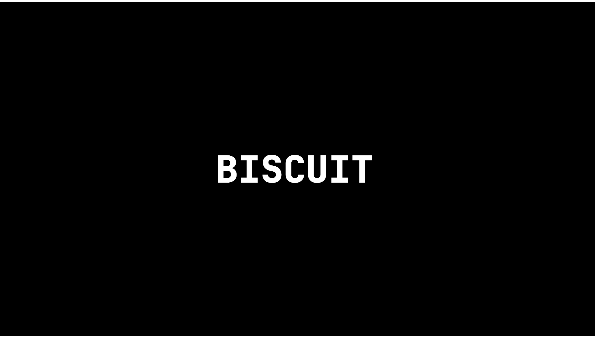
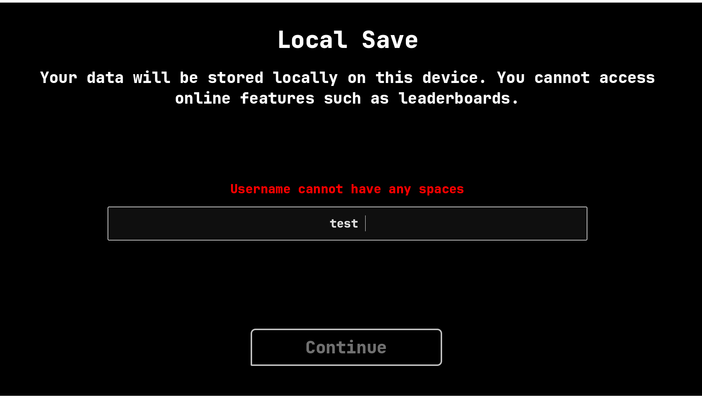
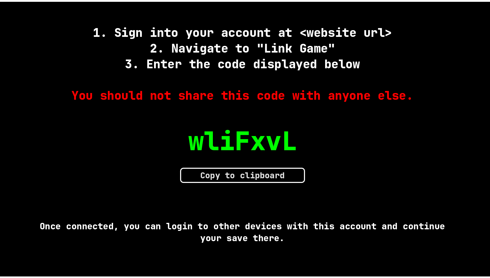

# Biscuit Game
This is the game part of the 'Biscuit' Project.

*Note all demo videos have been compressed.

*(Click to watch)*

---

### Repositories
[Server](https://github.com/yaseen-ahmed26/biscuit-server.git) | [Website](https://github.com/yaseen-ahmed26/biscuit-website.git)

---

### Tech
- **Engine**: Godot 4.7 (GDScript)

- **Websockets**: When linking an online account, Godot establishes a Websocket connection with the Server to listen out for when the user inputs the code on the website.

---

### About
This is a cookie clicker style game: click the button, gain biscuits, and purchase upgrades.

Features:
- **Local Saves**: Save your data locally, on your device.

- **Online Saves**: Save your data to an online account stored on the server. Access your data from anywhere.

 | 
:---: | :---:
*(Click to watch Local Save Demo)* | *(Click to watch Online Save Demo)*

---

### Future Features

Technical:
- **Converting Online data to Local**: Allow players to convert online progress to a local save file.
- **Offline mode**: Save local progress when the user has no internet and merge with online once reconnected.

Gameplay:
- **Passive Generation**: Upgradeable buildings.
- **Prestige**: Reset your data back to the start in exchange for a currency.
- **Autoclicker**: Make the game click for you.
- **Boosts**: Short time boosts.