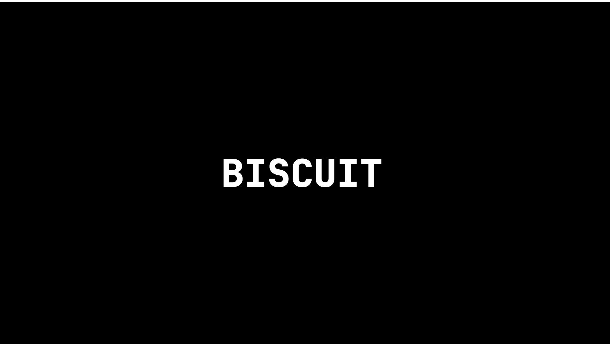

# Biscuit Game
This is the game part of the 'Biscuit' Project.

> **Live Demo**: [Download from Itch.io](https://corporalchicken.itch.io/biscuit)
>
> Available for **Windows** and **Linux** as a `.zip` download.
> Note that an account isn't required to play, but is needed for online saves.

---

### Preview
Note all demo videos have been compressed.

*(Click to watch)*

---

### Docs
- **Development Notes**: [NOTES.md](docs/NOTES.md). Challenges solved, decisions made.

- **Roadmap Notes**: [ROADMAP.md](docs/ROADMAP.md). The current v2 plan.

---

### Repositories
[Server](https://github.com/yaseen-ahmed26/biscuit-server.git) | [Website](https://github.com/yaseen-ahmed26/biscuit-website.git)

---

### Tech
- **Engine**: Godot 4.7

- **Language**: GDScript

---

### About
This is a cookie clicker style game featuring:

- **Online Saves**: Connect your account and save future progress to the server, allowing for cross device progression.

- **Offline Mode**: Play the game without an internet connection, with your data stored locally.

- **Upgrades**: Gain more biscuits quicker.

*(Click to watch)*

---

### Future Features

Gameplay:
- **Passive Generation**
- **Prestige**
- **Autoclicker**
- **Boosts**

More information can be found in roadmap notes.
